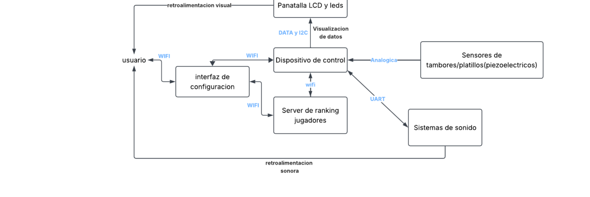
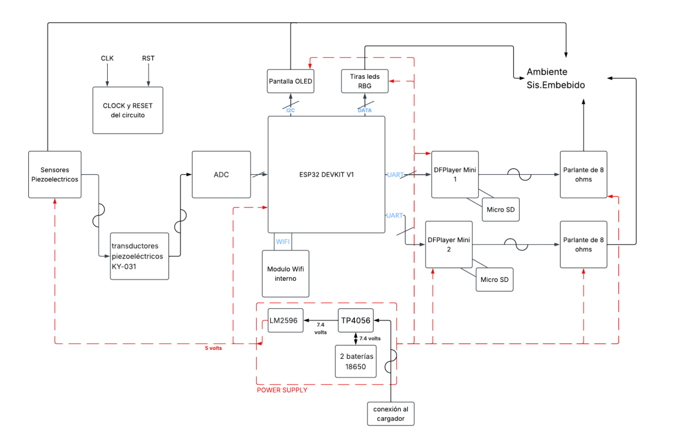
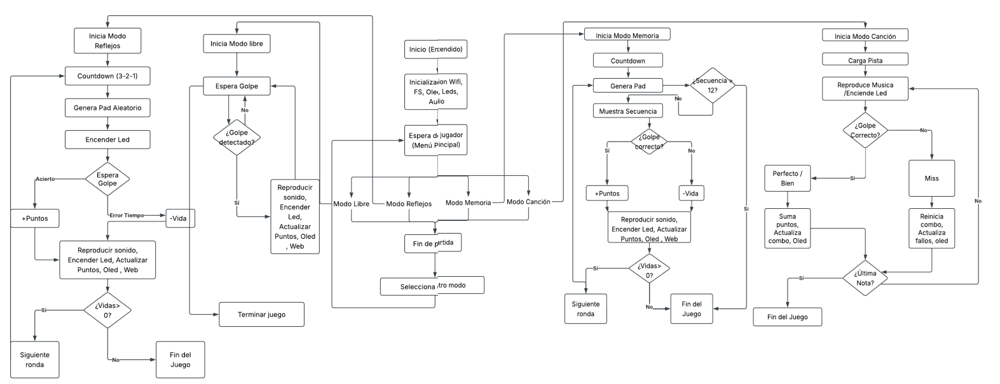
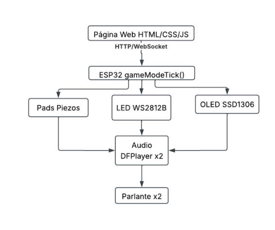
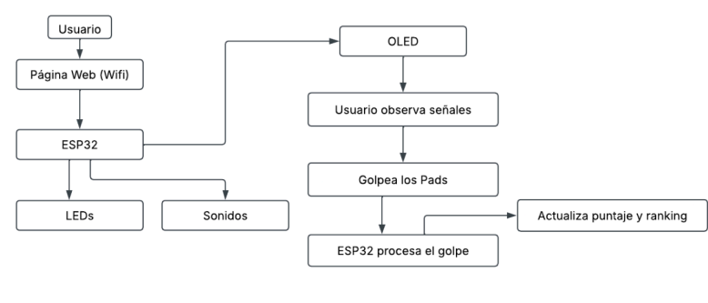

<<<<<<< HEAD
# 🥁 Batería Anti-Estrés Politécnico

# Batería Anti-Estrés Politécnico

**Integrantes**: Maria Grazia Bravo, Daniel Espinoza

## 1. Introducción

La Batería Anti-Estrés Politécnico es un instrumento electrónico interactivo diseñado para fusionar tecnología de IoT y sistemas embebidos de bajo costo. El propósito central es crear una plataforma que fomente la coordinación motora, los reflejos y el alivio del estrés académico mediante la percusión, ofreciendo retroalimentación lumínica y sonora en tiempo real. A diferencia de los instrumentos tradicionales, este sistema centraliza su lógica en un microcontrolador ESP32 y expande su accesibilidad y gamificación a través de una interfaz de red local inalámbrica.

## 2. Alcance y Limitaciones

### Dentro del Alcance:

- Construcción e integración mecánica de 6 pads de percusión individuales equipados con transductores piezoeléctricos KY-031 para la detección de impactos analógicos.
- Implementación de un sistema de retroalimentación lumínica inteligente LEDs RGB WS2812B y sonora SFX y pistas musicales a nivel local.
- Desarrollo de un servidor web embebido un Punto de Acceso Wi-Fi en el ESP32 para la gestión asíncrona de cuatro modos de juego y el registro de puntuaciones en tiempo real.

### Fuera del Alcance (Limitaciones Aceptadas):

- El procesamiento de audio es estrictamente local por hardware. No se abordará la transmisión de audio inalámbrico Bluetooth/Wi-Fi hacia auriculares para evitar los problemas inherentes de latencia que arruinarían la experiencia rítmica.
- El sistema no operará como un controlador MIDI de sensibilidad continua de grado profesional. La detección estará delimitada a umbrales de impacto hit/no-hit debido a las restricciones de respuesta transitoria y "crosstalk" de los discos cerámicos en chasis impresos.

## 3. Diagrama de Contexto

## 4. Diagrama de Bloques del Diseño

## 5. Máquina de Estados (Arquitectura de Software)

## 6. Diseño de Interfaces

**Interfaces entre componentes**

**Interacción con el usuario**

## 7. Alternativas de Diseño y Justificación Técnica

- **Arquitectura de Audio Dual vs. DAC Único**: Investigaciones previas sobre instrumentos electrónicos de bajo costo (Pinheiro & Silva, 2019) evidencian limitaciones severas de polifonía al intentar procesar y reproducir múltiples sonidos simultáneamente con hardware limitado. Solución Innovadora: Se descartó la generación de ondas I2S desde el ESP32. En su lugar, se emplean dos módulos DFPlayer independientes conectados mediante un mezclador pasivo de resistencias. Esto permite que un módulo maneje la pista de fondo ininterrumpidamente, mientras el otro reacciona instantáneamente a los golpes de batería, resolviendo el problema de polifonía sin sobrecargar la CPU del ESP32.

- **Regulación de Voltaje**: Inicialmente se evaluó usar módulos elevadores MT3608. Sin embargo, se implementó una topología Buck utilizando el LM2596. Justificación: Colocar las baterías 18650 en serie y reducir la tensión a 5V ofrece una eficiencia térmica superior y garantiza la entrega de hasta 3A continuos. Esta corriente es vital para evitar caídas de tensión cuando los LEDs WS2812B se activan simultáneamente.

- **Comunicación en Tiempo Real**: Se evaluó actualizar el ranking mediante polling HTTP periódico. Se descartó por generar latencia perceptible y tráfico innecesario en la red AP. Solución: Se implementó WebSocket, permitiendo que el ESP32 empuje actualizaciones de puntaje al instante en que ocurren, sin que el cliente tenga que solicitarlas.

## 8. Plan de Test y Validación

Se aplicarán pruebas sistemáticas para asegurar la robustez del diseño:

1. **Test de Diafonía**: Golpear el Pad 1 con fuerza máxima y monitorear el ADC del Pad 2. Se validará mediante la implementación de umbrales dinámicos (filtros de rebote por software) y aislamiento mecánico en el chasis 3D para evitar falsos positivos.

2. **Verificación de Latencia de Audio**: Medición mediante osciloscopio del delta de tiempo entre el pico analógico del piezoeléctrico y la señal de salida del amplificador. El criterio de aceptación es ≤ 40 ms para mantener la ilusión de simultaneidad rítmica.

3. **Test de Estrés Térmico y de Potencia**: Operar el Modo Canción a volumen máximo, con todos los LEDs al 100% de brillo blanco y el servidor web recibiendo peticiones continuas durante 30 minutos. Se medirá la temperatura del LM2596 y el TP4056 para verificar que se mantengan dentro del Área de Operación Segura.

## 9. Consideraciones Éticas y Sociales

- **Impacto Positivo**: El dispositivo funciona como una herramienta de estimulación neuromotora y alivio de ansiedad, acercando conceptos de electrónica y programación a usuarios de manera lúdica.

- **Contaminación Acústica**: El uso de un parlante de 3W puede resultar disruptivo en entornos académicos o de trabajo. Mitigación: Se implementará un control estricto del volumen máximo del DFPlayer por software, gestionable desde la interfaz web, para limitar los decibelios emitidos.

- **Gestión de Residuos Electrónicos**: La utilización de celdas de iones de litio 18650 representa un riesgo químico y de incendio si se perforan o se someten a estrés excesivo. Mitigación: El diseño encierra las baterías en un habitáculo rígido aislado, apoyado exclusivamente en el módulo de protección del TP4056 para prevenir cortocircuitos. Se incluirán advertencias en el manual sobre la disposición final en centros de reciclaje de E-waste.
>>>>>>> grazia
